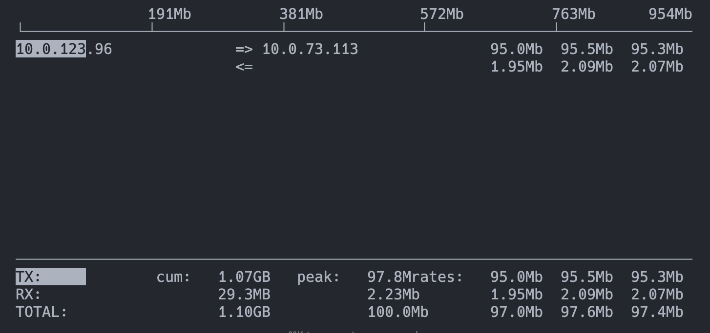
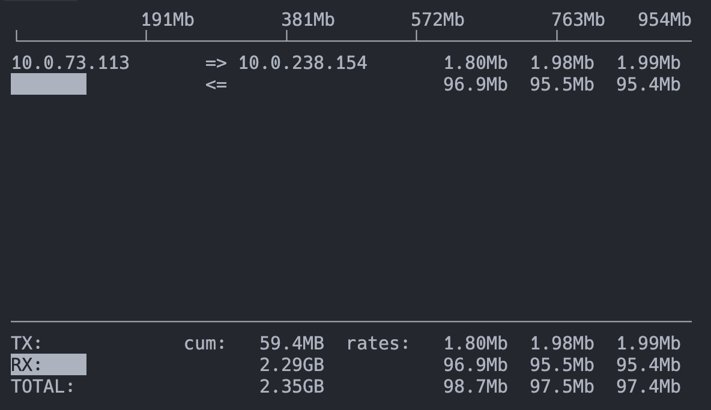

```bash
# One time setup
cp sample.envrc .envrc
# Go to https://wandb.ai/authorize and fill in the WANDB_API_KEY
direnv allow

source ~/miniconda3/bin/activate && conda create -y --prefix ./env python=3.10
source ~/miniconda3/bin/activate && conda activate ./env
pip install uv
uv pip install "torch==2.4.0" --index-url https://download.pytorch.org/whl/cu124
uv pip install flash-attn --no-build-isolation
uv pip install -e .
# uv pip install "torch==2.4.0+cu118" --upgrade --index-url https://download.pytorch.org/whl/cu118
# uv pip install --upgrade "nvidia-nccl-cu12==2.19.3"
# uv pip install --upgrade "nvidia-nccl-cu12==2.26.2"
# uv pip install --upgrade "nvidia-nccl-cu12==2.18.3"
uv pip install --upgrade --force-reinstall "ray[default]==2.10.0"

python3 -c "import torch; print(torch.version.cuda)"

tmux

# launch the master node of ray
source ~/miniconda3/bin/activate && conda activate ./env
ray start --head \
--node-ip-address $MASTER_NODE_IP \
--num-gpus 8 \
--dashboard-host 0.0.0.0 \
--include-dashboard true

# Worker nodes
source ~/miniconda3/bin/activate && conda activate ./env
ray start --address $MASTER_NODE_IP:6379  --num-gpus 8

# From master node
bash train_grpo_math_tune_ray.sh \
    --model_name Qwen/Qwen2.5-Math-7B \
    --train_batch_size 1024 \
    --rollout_n 8 \
    --kl_loss_coef 0.0001 \
    --entropy_coeffient 0.001 \
    --rollout_gpu_memory_util 0.75 \
    --rollout_tp 2 \
    --save_freq 5


# To view ray logs
tail -f /tmp/ray/session_*/logs/*


# Testing bandwidth
apt-get install -y iperf3
# Server
iperf3 -s
# Client
iperf3 -c $MASTER_NODE_IP -t 10

apt install iputils-ping
ping -c 10 $MASTER_NODE_IP

apt install iftop
iftop -i podnet1
```

### 1 A100 node and 1 H100 node in US-KS-2
- 1 A100 SXM node and 1 H100 NVL node in US-KS-2
- 95 Mbits/sec = 11.875 MB/sec
- Ping: average latency is 1.07ms

- ___ steps took ____ before transitioning to same DC same GPU setup
- Took 1h 6m until crash due to vllm version
- Took 1h 4m until crash due to context length
- Took ~1h until crash due to GLOO_SOCKET_IFNAME
- Took ___ until run was created in wandb

NCCL tests are timing out
```log
mpiuser@6e094e9a088e:/workspace/nccl-tests$ export NCCL_DEBUG=INFO
export NCCL_SOCKET_IFNAME=podnet1
mpirun --verbose -host $MASTER_IP,$WORKER_IP /workspace/nccl-tests/build/all_reduce_perf -b 8 -e 1M -f 2 -g 8 --timeout 10
hwloc/linux: Ignoring PCI device with non-16bit domain.
Pass --enable-32bits-pci-domain to configure to support such devices
(warning: it would break the library ABI, don't enable unless really needed).
# nThread 1 nGpus 8 minBytes 8 maxBytes 1048576 step: 2(factor) warmup iters: 5 iters: 20 agg iters: 1 validation: 1 graph: 0
#
# Using devices
#  Rank  0 Group  0 Pid 147147 on 6e094e9a088e device  0 [0000:2d:00] NVIDIA H100 NVL
#  Rank  1 Group  0 Pid 147147 on 6e094e9a088e device  1 [0000:3a:00] NVIDIA H100 NVL
#  Rank  2 Group  0 Pid 147147 on 6e094e9a088e device  2 [0000:3b:00] NVIDIA H100 NVL
#  Rank  3 Group  0 Pid 147147 on 6e094e9a088e device  3 [0000:3c:00] NVIDIA H100 NVL
#  Rank  4 Group  0 Pid 147147 on 6e094e9a088e device  4 [0000:ad:00] NVIDIA H100 NVL
#  Rank  5 Group  0 Pid 147147 on 6e094e9a088e device  5 [0000:ae:00] NVIDIA H100 NVL
#  Rank  6 Group  0 Pid 147147 on 6e094e9a088e device  6 [0000:bd:00] NVIDIA H100 NVL
#  Rank  7 Group  0 Pid 147147 on 6e094e9a088e device  7 [0000:be:00] NVIDIA H100 NVL
#  Rank  8 Group  0 Pid  99094 on 2bbc82db84d9 device  0 [0000:07:00] NVIDIA A100-SXM4-80GB
#  Rank  9 Group  0 Pid  99094 on 2bbc82db84d9 device  1 [0000:0f:00] NVIDIA A100-SXM4-80GB
#  Rank 10 Group  0 Pid  99094 on 2bbc82db84d9 device  2 [0000:47:00] NVIDIA A100-SXM4-80GB
#  Rank 11 Group  0 Pid  99094 on 2bbc82db84d9 device  3 [0000:4e:00] NVIDIA A100-SXM4-80GB
#  Rank 12 Group  0 Pid  99094 on 2bbc82db84d9 device  4 [0000:87:00] NVIDIA A100-SXM4-80GB
#  Rank 13 Group  0 Pid  99094 on 2bbc82db84d9 device  5 [0000:90:00] NVIDIA A100-SXM4-80GB
#  Rank 14 Group  0 Pid  99094 on 2bbc82db84d9 device  6 [0000:b7:00] NVIDIA A100-SXM4-80GB
#  Rank 15 Group  0 Pid  99094 on 2bbc82db84d9 device  7 [0000:bd:00] NVIDIA A100-SXM4-80GB
6e094e9a088e:147147:147147 [0] NCCL INFO NCCL_SOCKET_IFNAME set by environment to podnet1
6e094e9a088e:147147:147147 [0] NCCL INFO Bootstrap: Using podnet1:10.0.123.96<0>
6e094e9a088e:147147:147147 [0] NCCL INFO cudaDriverVersion 12070
6e094e9a088e:147147:147147 [0] NCCL INFO NCCL version 2.26.2+cuda12.8
6e094e9a088e:147147:147211 [6] NCCL INFO NET/Plugin: Could not find: libnccl-net.so. Using internal net plugin.
6e094e9a088e:147147:147211 [6] NCCL INFO NCCL_SOCKET_IFNAME set by environment to podnet1
6e094e9a088e:147147:147211 [6] NCCL INFO NET/IB : No device found.
6e094e9a088e:147147:147211 [6] NCCL INFO NET/IB : Using [RO]; OOB podnet1:10.0.123.96<0>
6e094e9a088e:147147:147211 [6] NCCL INFO NCCL_SOCKET_IFNAME set by environment to podnet1
6e094e9a088e:147147:147211 [6] NCCL INFO NET/Socket : Using [0]podnet1:10.0.123.96<0>
6e094e9a088e:147147:147211 [6] NCCL INFO PROFILER/Plugin: Could not find: libnccl-profiler.so. 
6e094e9a088e:147147:147211 [6] NCCL INFO Using network Socket
6e094e9a088e:147147:147212 [7] NCCL INFO Using network Socket
6e094e9a088e:147147:147210 [5] NCCL INFO Using network Socket
6e094e9a088e:147147:147208 [3] NCCL INFO PROFILER/Plugin: Could not find: libnccl-profiler.so. 
6e094e9a088e:147147:147208 [3] NCCL INFO Using network Socket
6e094e9a088e:147147:147207 [2] NCCL INFO Using network Socket
6e094e9a088e:147147:147205 [0] NCCL INFO Using network Socket
6e094e9a088e:147147:147209 [4] NCCL INFO Using network Socket
6e094e9a088e:147147:147206 [1] NCCL INFO Using network Socket
6e094e9a088e:147147:147209 [4] NCCL INFO ncclCommInitRank comm 0x5573b31361d0 rank 4 nranks 16 cudaDev 4 nvmlDev 4 busId ad000 commId 0xc5194a2a2d53c3b9 - Init START
6e094e9a088e:147147:147205 [0] NCCL INFO ncclCommInitRank comm 0x5573b2f05680 rank 0 nranks 16 cudaDev 0 nvmlDev 0 busId 2d000 commId 0xc5194a2a2d53c3b9 - Init START
6e094e9a088e:147147:147210 [5] NCCL INFO ncclCommInitRank comm 0x5573b31c2380 rank 5 nranks 16 cudaDev 5 nvmlDev 5 busId ae000 commId 0xc5194a2a2d53c3b9 - Init START
6e094e9a088e:147147:147207 [2] NCCL INFO ncclCommInitRank comm 0x5573b301de70 rank 2 nranks 16 cudaDev 2 nvmlDev 2 busId 3b000 commId 0xc5194a2a2d53c3b9 - Init START
6e094e9a088e:147147:147206 [1] NCCL INFO ncclCommInitRank comm 0x5573b2f91cc0 rank 1 nranks 16 cudaDev 1 nvmlDev 1 busId 3a000 commId 0xc5194a2a2d53c3b9 - Init START
6e094e9a088e:147147:147208 [3] NCCL INFO ncclCommInitRank comm 0x5573b30aa020 rank 3 nranks 16 cudaDev 3 nvmlDev 3 busId 3c000 commId 0xc5194a2a2d53c3b9 - Init START
6e094e9a088e:147147:147211 [6] NCCL INFO ncclCommInitRank comm 0x5573b324e530 rank 6 nranks 16 cudaDev 6 nvmlDev 6 busId bd000 commId 0xc5194a2a2d53c3b9 - Init START
6e094e9a088e:147147:147212 [7] NCCL INFO ncclCommInitRank comm 0x5573b32da6e0 rank 7 nranks 16 cudaDev 7 nvmlDev 7 busId be000 commId 0xc5194a2a2d53c3b9 - Init START
6e094e9a088e:147147:147173 [0] NCCL INFO socketStartConnect: connect returned Connection timed out, retrying (1/34) after sleep for 100 msec
6e094e9a088e:147147:147173 [0] NCCL INFO socketStartConnect: connect returned Connection timed out, retrying (2/34) after sleep for 200 msec
6e094e9a088e:147147:147173 [0] NCCL INFO socketStartConnect: connect returned Connection timed out, retrying (3/34) after sleep for 300 msec
6e094e9a088e:147147:147173 [0] NCCL INFO socketStartConnect: connect returned Connection timed out, retrying (4/34) after sleep for 400 msec
6e094e9a088e:147147:147173 [0] NCCL INFO socketStartConnect: connect returned Connection timed out, retrying (5/34) after sleep for 500 msec
6e094e9a088e:147147:147173 [0] NCCL INFO socketStartConnect: connect returned Connection timed out, retrying (6/34) after sleep for 600 msec
```

### 2 A100 nodes in different DCs
- One node in US-KS-2 and the other in CA-MTL-3
- Had to keep a 8x A100 PCIE allocated for 9 hours before the second node was available
- 95 Mbits/sec = 11.875 MB/sec
  - Ping: average latency is 26.8ms

- Jobs took a while to start, so I moved onto same DC setup


Qwen/Qwen2.5-Math-7B: Max context length: 4096
- Max prompt length: 1024
- Max response length: 
